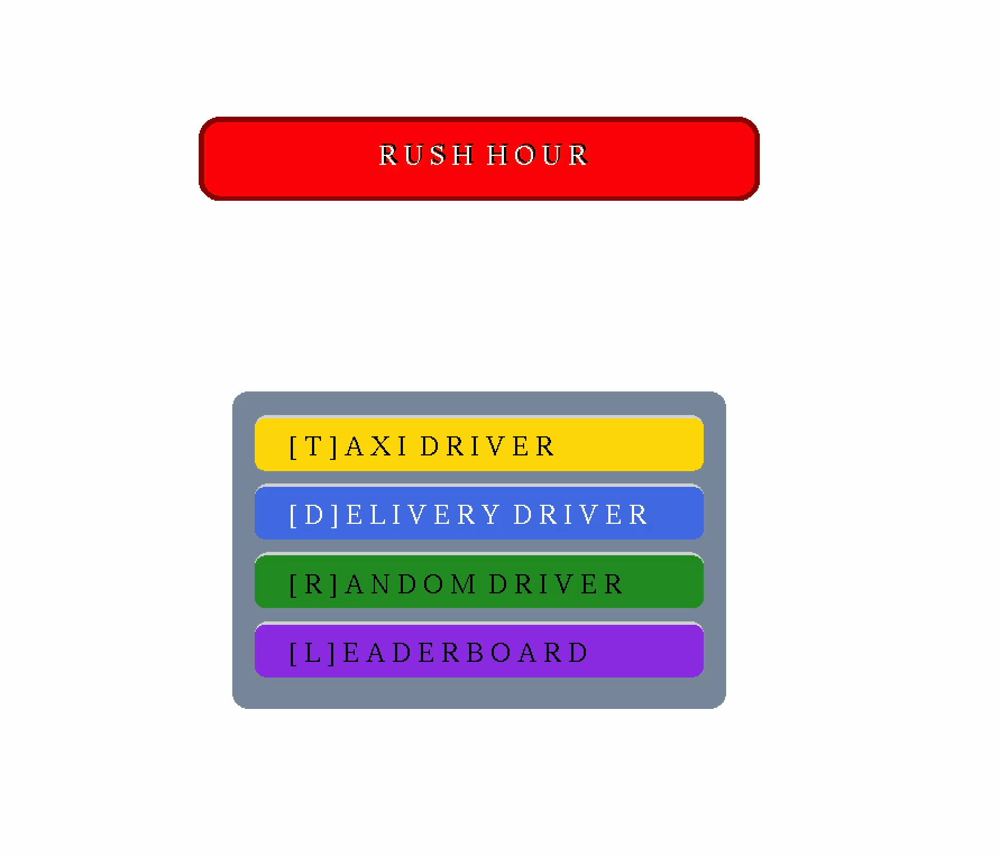
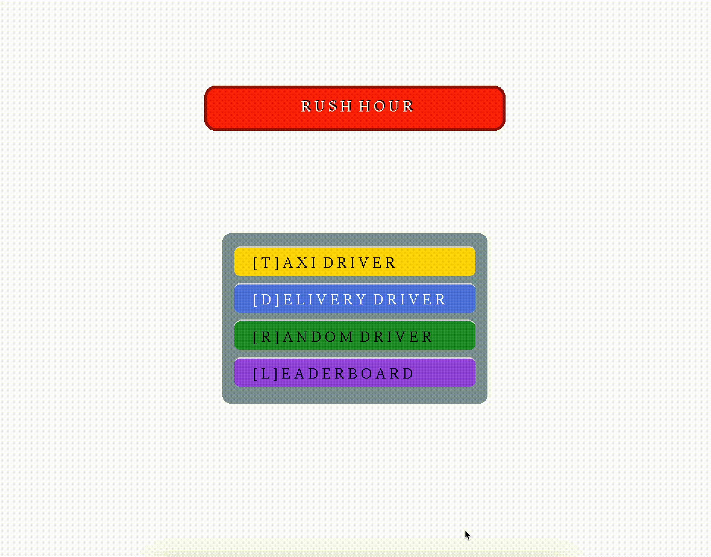

# RUSH HOUR OOP



**Rush Hour** is a traffic taxi/delivery driver simulation game built using Object-Oriented Programming principles. Players navigate through city traffic, picking up passengers, delivering packages, and managing fuel while avoiding obstacles.

---

## Table of Contents

1. [Features](#features)
2. [Setup Instructions](#setup-instructions)
3. [How to Play](#how-to-play)
4. [Code Structure](#code-structure)
5. [Gameplay Preview](#gameplay-preview)

---

## Features

* Complete object-oriented design with multiple classes
* Dynamic traffic simulation with NPCs
* Role-changing mechanics (switch between passenger delivery and package delivery)
* Fuel management system
* Real-time leaderboard tracking
* Multiple obstacle types to navigate around

---

## Setup Instructions

### Prerequisites

* C++ compiler (G++) or (clang++)
* Required libraries (OpenGL, GLUT, GLEW)

### Steps

1. Clone the repository:

```bash
git clone https://github.com/HassanSep21/rush_hour.git
cd rush_hour
make
./game
```

## How to Play

1. Control your vehicle through traffic using arrow keys
2. Pick up passengers/packages [SPACE-BAR]
3. Deliver to highlighted destinations to earn points [SPACE-BAR]
4. Visit fuel stations to refill your tank [F]
5. Use role-change stations to switch between passenger and package delivery modes [P]
6. Avoid obstacles to prevent damage and slowdowns
7. Aim for a high score on the leaderboard

## Code Structure

The game is built using the following classes:

* **GameController**: Manages overall game flow and state
* **Player**: Handles player vehicle movement and status
* **Car**: Base class for all vehicles in the game
* **NPC**: Controls non-player vehicle behavior
* **Passenger**: Represents passengers to be picked up and delivered
* **Package**: Represents packages to be collected and delivered
* **FuelStation**: Allows the player to refill their vehicle
* **RoleChangeStation**: Enables switching between different gameplay modes
* **Obstacle**: Represents various obstacles in the game world
* **Board**: Manages the game board/map layout
* **Leaderboard**: Tracks and displays high scores

## Gameplay Preview


